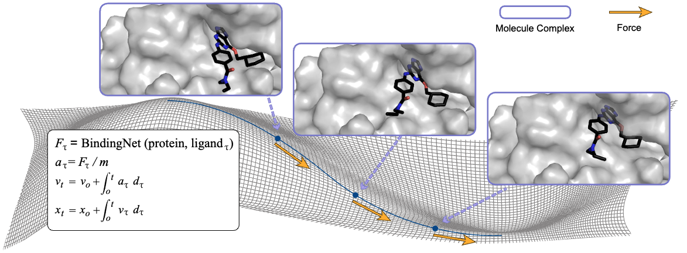
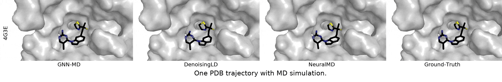

# **NeuralMD:** A Multi-Grained Symmetric Differential Equation Model for Learning Protein-Ligand Binding Dynamics

Authors: Shengchao Liu*, Weitao Du*, Hannan Xu, Yanjing Li, Zhuoxinran Li, Vignesh Bhethanabotla, Divin Yan, Christian Borgs*, Anima Anandkumar*, Hongyu Guo*, Jennifer Chayes*

[[Project Page](https://chao1224.github.io/NeuralMD)] [[ArXiv](https://arxiv.org/abs/2401.15122)]
[[Datasets on HuggingFace](https://huggingface.co/datasets/chao1224/NeuralMD/tree/main)] [[Checkpoints on HuggingFace](https://huggingface.co/chao1224/NeuralMD/tree/main)]

<p align="center">
   
</p>

<p align="left">
   
</p>


# 1. Environment

## Conda

Setup the anaconda
 ```bash
wget https://repo.continuum.io/archive/Anaconda3-2019.10-Linux-x86_64.sh
bash Anaconda3-2019.10-Linux-x86_64.sh -b
export PATH=$PWD/anaconda3/bin:$PATH
 ```

## Packages
Start with some basic packages.
```bash
conda create -n Geom3D python=3.9
conda activate Geom3D
conda install -y numpy networkx scikit-learn
conda install -y -c conda-forge rdkit
conda install -y pytorch==2.2 pytorch-cuda=12.1 -c pytorch -c nvidia
conda install -y -c pyg -c conda-forge pyg=2.5
conda install -y -c pyg pytorch-scatter
conda install -y -c pyg pytorch-sparse
conda install -y -c pyg pytorch-cluster

pip install ogb==1.2.1

pip install sympy

pip install ase

pip install lie_learn # for TFN and SE3-Trans

pip install packaging # for SEGNN
pip3 install e3nn # for SEGNN

pip install transformers # for smiles
pip install selfies # for selfies

pip install atom3d # for Atom3D
pip install cffi # for Atom3D
pip install biopython # for Atom3D

pip install cython # for pyximport 

conda install -y -c conda-forge py-xgboost-cpu # for XGB

pip install pymatgen  # for CIF loading
pip install h5py

pip install torch-ema

git clone git@github.com:chao1224/torchdiffeq.git
cd torchdiffeq

pip install MDAnalysis

pip install -e .
```

# 2. Datasets Preparation

We provide two ways to generate the datasets for MISATO.
1. We provide the script under `data/MISATO` to generate two sub-datasets, and you can check the `data/README.md` for more details.
2. You can download the datasets from zenodo and HuggingFace directly.
  2.1. You can download the MISATO `MD.hdf5` data from [zenodo link](https://zenodo.org/records/7711953), or use the following CMD:
  ```
  wget -O data/MD/h5_files/MD.hdf5 https://zenodo.org/record/7711953/files/MD.hdf5
  ```
  2.2. Then you can download the dataset from [HuggingFace link](https://huggingface.co/datasets/chao1224/NeuralMD/tree/main) provided by us.

The data folder structure looks like the following:
```
.
`-- MISATO_1000
|   `-- raw
|   |   `-- train_MD.txt
|   |   `-- test_MD.txt
|   |   `-- MD.hdf5
|   |   `-- val_MD.txt
`-- MISATO
|   `-- raw
|   |   `-- train_MD.txt
|   |   `-- test_MD.txt
|   |   `-- MD.hdf5
|   |   `-- val_MD.txt
`-- README.md
`-- MISATO_100
|   `-- raw
|   |   `-- train_MD.txt
|   |   `-- test_MD.txt
|   |   `-- MD.hdf5
|   |   `-- val_MD.txt
```

# 3. Scripts

Please check `examples` for semi-flexible binding experiments.

We have two types of tasks
- `multi_traj`
- `single_traj`
and four ML methods
- `VerletMD`
- `GNNMD`
- `DenoisinLD`
- `NeuralMD`
  - `--NeuralMD_binding_model=NeuralMD_Binding01` for NeuralMD ODE
  - `--NeuralMD_binding_model=NeuralMD_Binding02` or `--NeuralMD_binding_model=NeuralMD_Binding04` for NeuralMD SDE

# 4. Checkpoints

We provide the optimal checkpoints and corresponding hyperparameters at [this HuggingFace link](https://huggingface.co/chao1224/NeuralMD/tree/main).

# Cite Us

Feel free to cite this work if you find it useful to you!

```
@inproceedings{
    @article{liu2024NeuralMD,
    title={A Multi-Grained Symmetric Differential Equation Model for Learning Protein-Ligand Binding Dynamics},
    author={Liu, Shengchao* and Du, Weitao* and Xu, Hannan and Li, Yanjing and Li, Zhuoxinran and Bhethanabotla, Vignesh and Liang, Yan and Borgs, Christian* and Anandkumar, Anima* and Guo, Hongyu* and Chayes, Jennifer*},
    journal={arXiv preprint arXiv:2401.15122},
    year={2024}
}
```
